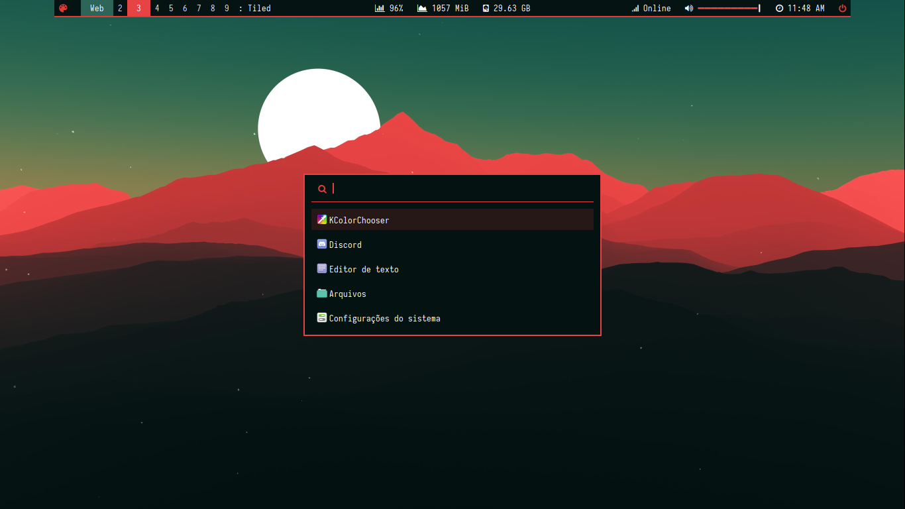
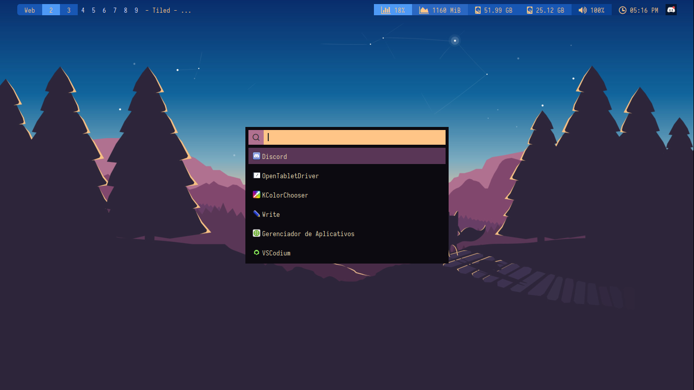

# A Installation Tutorial for Xmonad, Polybar, Rofi and Picom to distros linux based on Debian or Ubuntu.

**Introduction**

* First of all, install ghc, which is a GHC Haskell compiler to build xmonad, X11 libraries, and Cabal package manager.

    `sudo apt-get install ghc`
    `sudo apt-get install libx11-dev`
    `sudo apt-get install cabal-install`

**Installing Xmonad via Cabal**

* Update cabal, and then, install xmonad.

    <code>cabal v2-update 
    cabal install xmonad</code>
    
* Changing the session to Xmonad

    Before that, you need to add, manually, a sesssion file to start Xmonad.
    
    `sudo touch /usr/share/xsessions/xmonad.desktop`

    After created, access the file using nano and write this code:

    <code>[Desktop Entry]
    Name=Xmonad
    Comment=Xmonad Session
    Exec=~/.cabal/bin/xmonad
    Type=Application</code> 

    You can login in Xmonad session right now, but you will find a black screen, and nothing to do without a xmonad.hs, the xmonad config file, located on ~/.xmonad. So, let’s customize this a little more, installing xmonad-contrib and xmonad-extras.
    
    __Note: you can use my xmonad config file here.__

* To install xmonad-contrib and xmonad-extras is necessary some libraries.

    `sudo apt-get install libxrandr-dev libxss-dev libasound2-dev c2hs`

    After that, install these packages via cabal.

    `cabal install xmonad-contrib xmonad-extras`

**Installing Rofi Launcher**

* In Xmonad session there is no menu or something similar. So, install rofi, a lightweight launcher.

    `sudo apt-get install rofi`

* To access rofi, custom a key combo on xmonad config file. Like this:

    `-- launch rofi`
        `, ((modm                , xK_p      ), spawn "rofi -no-config -no-lazy-grab -show drun -modi drun -theme PATH")`

**Installing Nitrogen, a wallpaper manager; and LXAppearance, a gtk theme manager**

* Black screen, uh? It’s better with a wallpaper and a gtk theme. Then, nitrogen and lxappearance will fit it.

    `sudo apt-get install -y nitrogen lxappearance`

    Access nitrogen and lxappearance with rofi or via terminal.

**Building and Installing Picom, a compositor for animations, blur, rounded corners, etc**

* Download/clone a git of jonaburg-picom: https://github.com/jonaburg/picom

    `git clone https://github.com/jonaburg/picom.git`

* but, build it, install all these dependencies:

    `sudo apt-get install -y meson libxext-dev libxcb1-dev libxcb-damage0-dev libxcb-xfixes0-dev libxcb-shape0-dev libxcb-render-util0-dev libxcb-render0-dev libxcb-randr0-dev libxcb-composite0-dev libxcb-image0-dev libxcb-present-dev libxcb-xinerama0-dev libxcb-glx0-dev libpixman-1-dev libdbus-1-dev libconfig-dev libgl1-mesa-dev  libpcre2-dev  libevdev-dev uthash-dev libev-dev libx11-xcb-dev`

* Inside the picom directory, type: 

    `git submodule update --init --recursive`
    `meson --buildtype=release . build`
    `LDFLAGS="-L/path/to/libraries" CPPFLAGS="-I/path/to/headers" meson --buildtype=release . build`

    And to install it:

    `sudo ninja -C build install`

    Restart the session to see picom working. 

    __Note: I don't know how to config the picom yet.__

**Building and Installing Polybar, a bar for view and control your workspaces, cpu, ram, volume, date, etc**

* Clone the project on github: https://github.com/polybar/polybar

    `git clone https://github.com/polybar/polybar.git`

* To build Polybar we will need to install some dependencies:

    `sudo apt-get install -y cmake pkg-config build-essential python3-sphinx libcairo2-dev libmpdclient-dev libiw-dev libpulse-dev libxcb-randr0-dev libxcb-composite0-dev xcb-proto libxcb-xkb-dev libalsa-ocaml libalsa-ocaml-dev libxcb-* python3-xcbgen libjsoncpp-dev i3-wm`

* Now, inside the polybar directory, type:

    `sudo ./build.sh`

* To initiate polybar with xmonad, in xmonad config file, write this code inside myStartupHook:

    `spawn "polybar -q Name_of_bar -c PATH"`

    The name of bar will be found on config file, like this, `[bar/Name_of_bar]`

**Communicating Xmonad and Polybar with Xmonad DBus**

* To install xmonad-dbus is necessary some libraries:

    `sudo apt-get install libghc-zlib-dev`

    After that, install xmonad-dbus.

    `cabal install xmonad-dbus`

* Now in polybar config file, write this code:

    <code>[module/xmonad]
    type = custom/script
    exec = ~/.cabal/bin/xmonad-dbus
    tail = true
    interval = 0</code>

    This is a module. It’s needed to load your xmonad workspaces, for example, in polybar.

    Still in config file, write this code:

    <code>
    modules-left = xmonad 
    modules-center = 
    modules-right =
    </code>

    Here, the xmonad module is loaded on left of bar.

**Increasing the performance on boot**

**Disabling the login screen and use xinit to start the DE**

* To run Xmonad without any error, we will need to disable the login screen. 

    Disable your display manager. It can be the lightdm(Ubuntu), gmd(Gnome), kdm(KDE), sddm(KDE). Use this command to know:

    `cat /etc/X11/default-display-manager`
    
    For example:

    `sudo systemctl disable lightdm`

    Doing that, your login screen will be a terminal screen, and to start the xmonad session is necessary to install Xinit.

    `sudo apt install xinit`

* Now, we will create a .xinitrc file on home and via nano write this code:
    
    <code>export $(dbus-launch)
    exec ~/.cabal/bin/xmonad</code>

Done! To initiate the xmonad session, only type **startx** on terminal after login.

**Suggestions for customize the Polybar and Rofi**
* Githubs with awesome themes:
    https://github.com/adi1090x/polybar-themes
    https://github.com/ngynLk/polybar-themes

**Here! Two screenshots of my workspaces**

I used some of adi1090x polybar and rofi themes.
